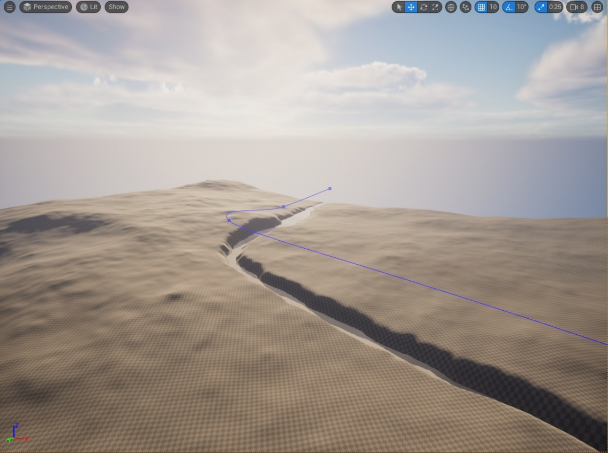

# River Tool

This is a procedural river generation tool that developed by Houdini, and is intended to be imported and used in Unreal Engine.

The basic concepts and stage of river generation of this tool is:

- The input of the tool is user customize terrain data or randomly genereated terrain.

- A "Railing  Tool" that allows user to draw a line in the terrain to represent the river. 

- The tool will read the height, normal, other relative information to generate river bed and river surface.

- The tool also expose useful parameter for user to alter the river, such: width, normal, surface, etc.

The Demo video can see here:

